<div align="center">


# **GenAxis**
### _Next-Gen AI Web Platform Built with PERN Stack_  
**Design Inspired by [Huly.io](https://huly.io)**


</div>

---

## ✨ Overview

**GenAxis** is an open-source **AI-powered creative platform** built using the **PERN Stack (PostgreSQL, Express, React, Node.js)** and inspired by the sleek, minimal design of **Huly.io**.

It empowers users to generate and explore AI content — from **images and text to design tools** — all inside a beautiful, responsive web app.

---

## 🧠 Features

### 💡 AI Tools  
- 🖼️ **AI Image Generation** — turn your ideas into visuals  
- ✍️ **AI Article Writer** — generate SEO-friendly content  
- 🧾 **Resume Reviewer** — polish your CV instantly  
- 🧩 **Blog Title Generator** — create catchy headlines  
- 🪄 **Background & Object Removal** — one-click smart editing  

### 🌍 Community & Dashboard  
- 🚀 Public **Community Gallery** showcasing AI-generated images  
- 📊 Modern **Dashboard UI** for managing creations  

### 🔐 Authentication & Billing  
- 🪪 **Clerk Authentication System**  
- 💳 **Clerk Billing Integration** for seamless premium control  

### ⚙️ Developer Friendly  
- Modular **PERN architecture**  
- Clean folder structure and scalable components  
- Easy to **fork**, **extend**, and **self-host**

---

## 🎨 First Look of the Webpage

> _A glimpse into the GenAxis UI — clean, fluid, and AI-driven._

<p align="center">
  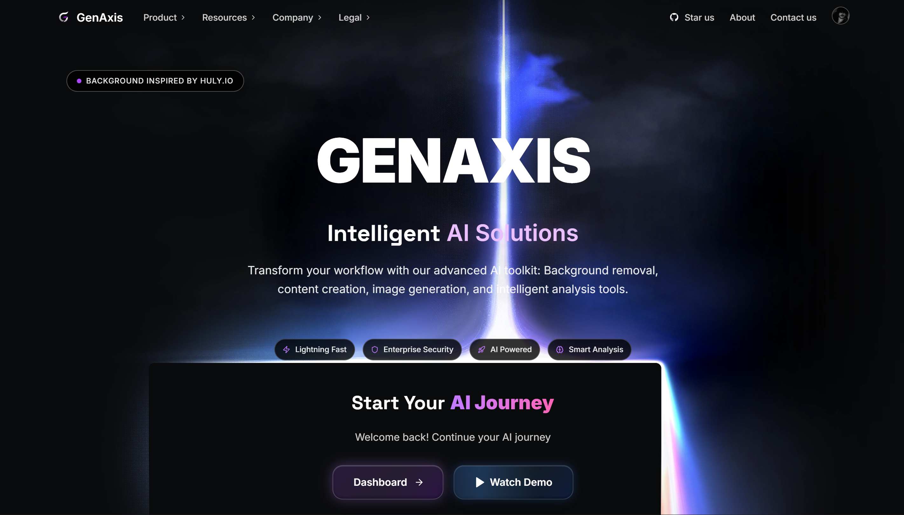
  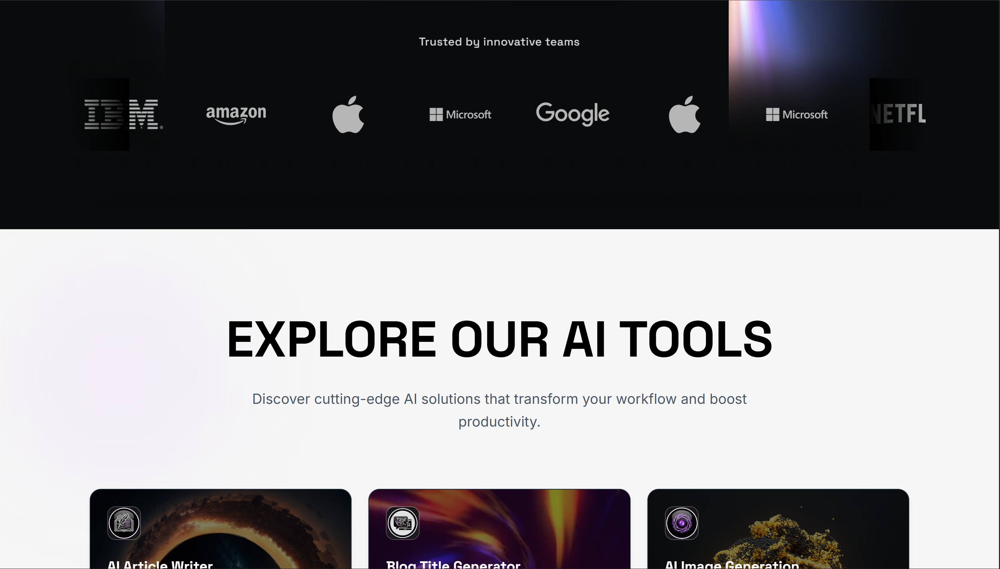
  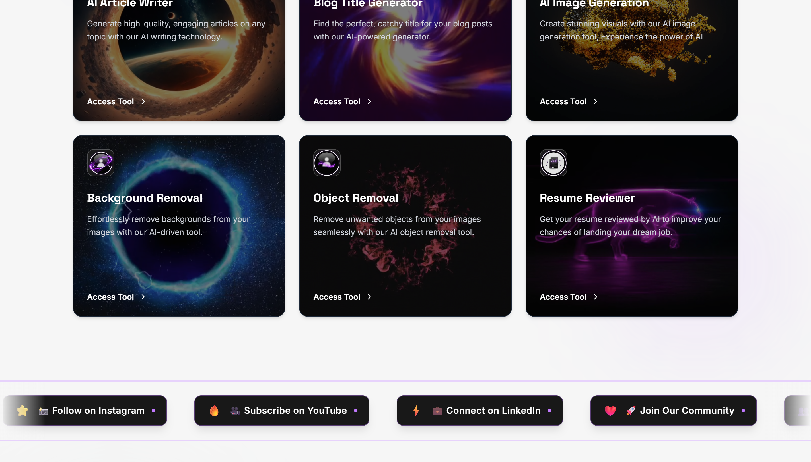
  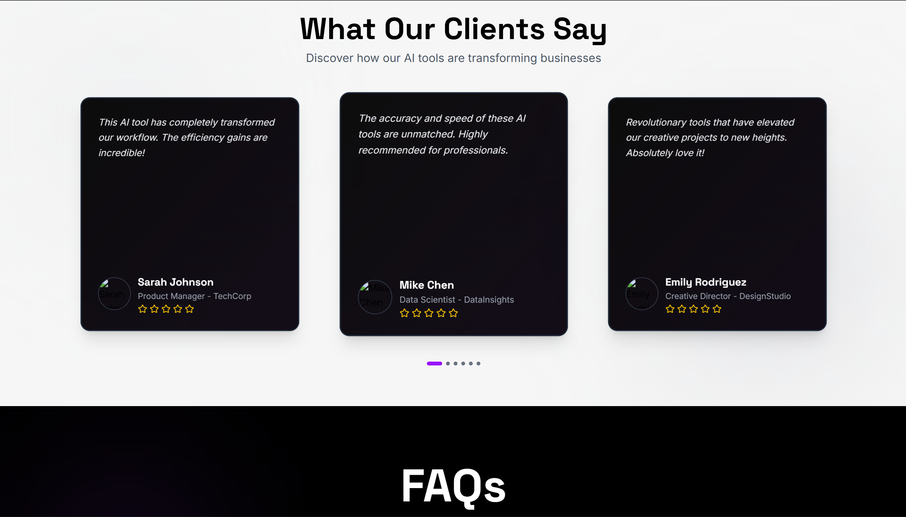
  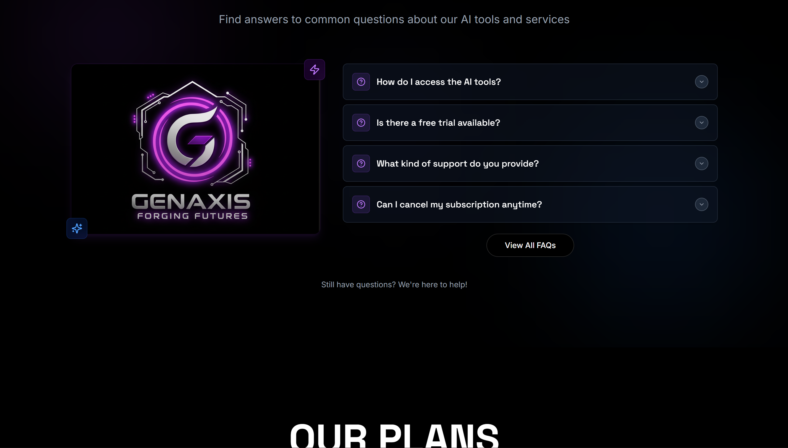
  
  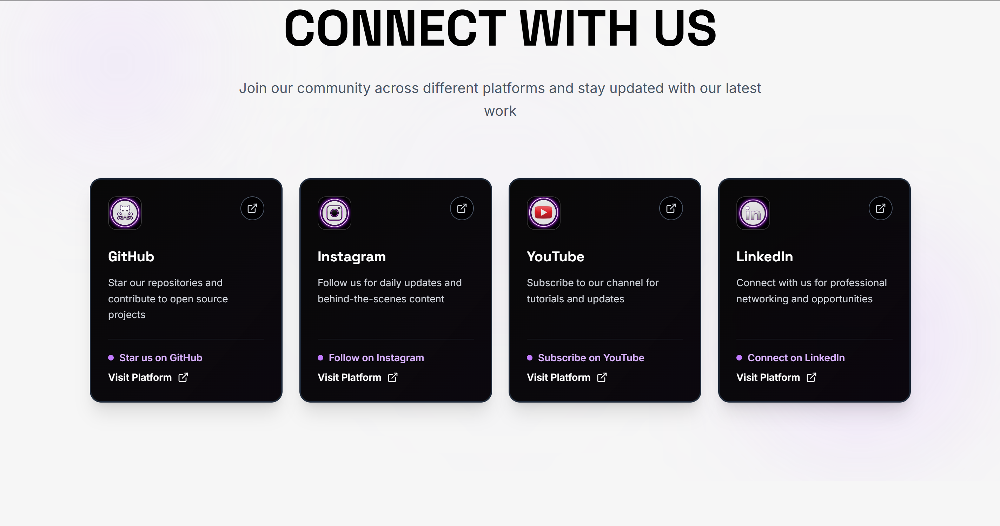
  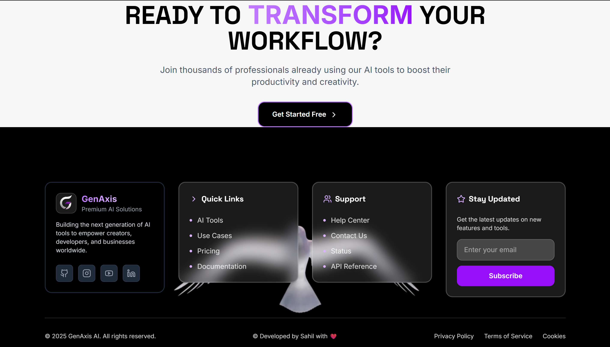
  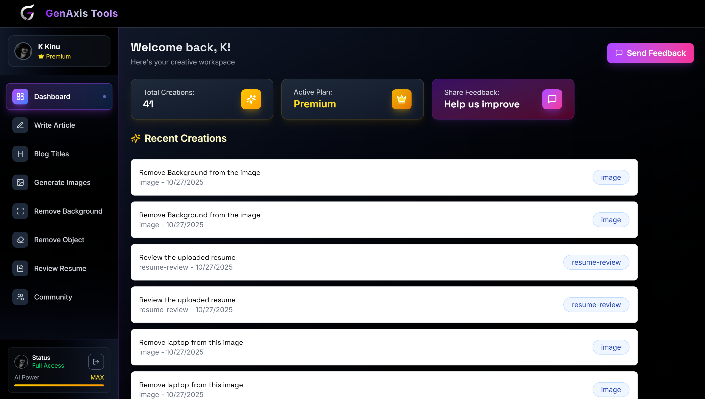
  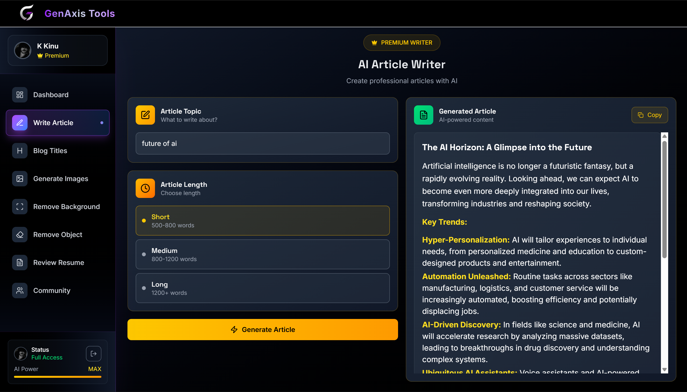
  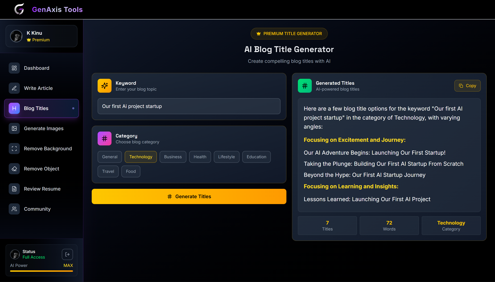
  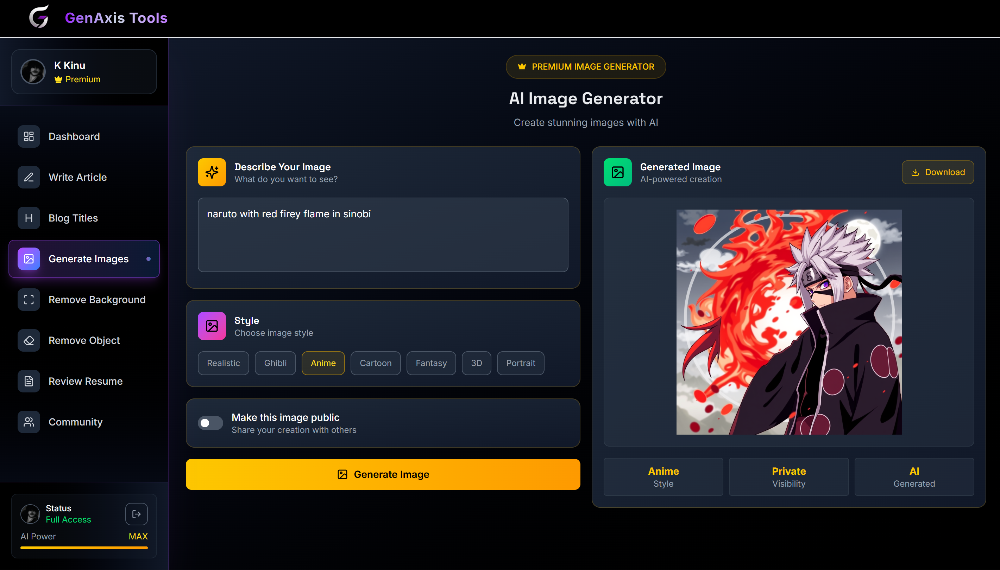
  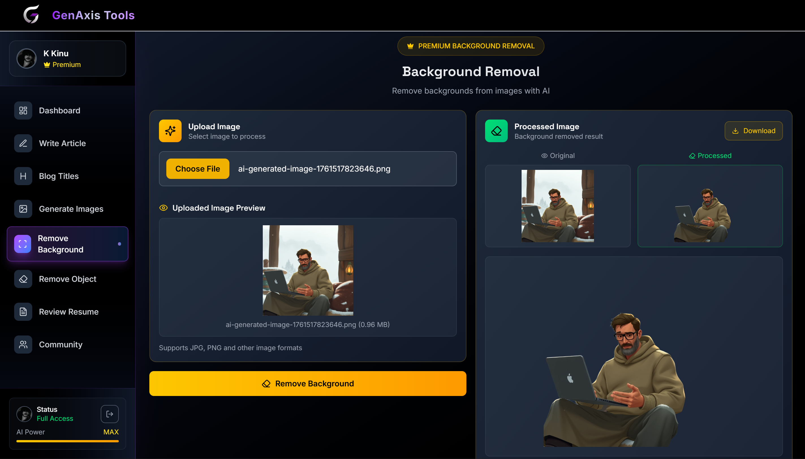
  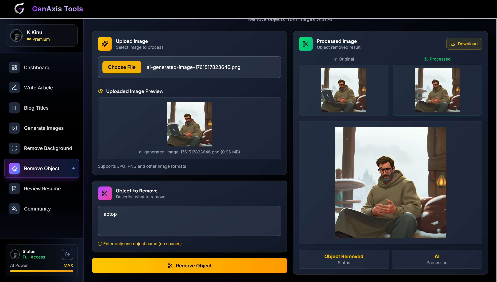
  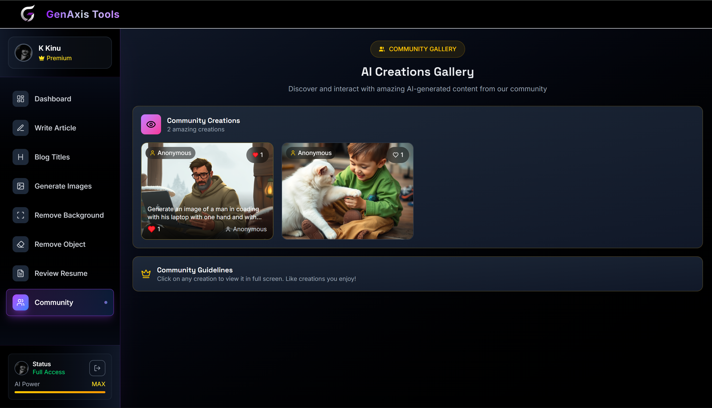
</p>

---

## 🧩 Tech Stack

| Layer | Technology |
|-------|-------------|
| **Frontend** | React.js + TailwindCSS |
| **Backend** | Node.js + Express.js |
| **Database** | PostgreSQL |
| **AI Integration** | OpenAI API |
| **Auth & Billing** | Clerk |
| **Deployment** | Vercel / Render |

---

## 🫶 Inspiration

GenAxis draws its **UI/UX inspiration** from **Huly.io**, blending:
- Minimalist layout  
- Gradient highlights  
- Dark-mode friendly visuals  
- Micro-interactions for a premium feel  

> The goal: make open-source **feel like a polished SaaS**.

---

## 💻 Getting Started

### 🔧 Installation
```bash
# Clone the repo
git clone https://github.com/yourusername/GenAxis.git

# Navigate
cd GenAxis

# Install dependencies
npm install

# Set environment variables
cp .env.example .env

# Run development server
npm run dev
````

### ⚙️ Environment Variables

You’ll need API keys for:

* **OpenAI API**
* **Clerk**
* **Database URL (PostgreSQL)**

---

## 🤝 Contributing

We welcome contributors! Here’s how to get involved:

1. 🍴 **Fork** this repo
2. 🌿 Create a branch — `feature/your-feature-name`
3. 💾 Commit your work
4. 🚀 Submit a **Pull Request**

> Every idea, fix, and improvement helps GenAxis grow.

---

## 🌟 Show Your Support

If you find GenAxis useful:

* ⭐ **Star** the repo
* 🍴 **Fork** it
* 🧠 **Contribute** ideas
* 💬 **Share feedback** or suggestions
* 💖 **Sponsor** the project

> Your support helps keep this project alive and evolving.

---

## 🪪 License

**License No: GA-OSS-2025**
📜 This project is under a **Non-Commercial License**.
You may **use, modify, and share** the code **for personal and educational purposes only**.

> ❌ Commercial redistribution or selling is strictly prohibited.

---

## 👨‍💻 Developed By

**Sahil**

> *Building intelligent, open-source solutions for a creative web.*

💌 Reach out via GitHub Discussions or Issues for feedback, ideas, or sponsorships.

---

## 💫 Final Message

Thanks for visiting **GenAxis**!
Your curiosity, creativity, and collaboration make open source thrive. 🌍💖

> 🚀 *Best of luck, and happy building with GenAxis!*

---

<div align="center">
  <sub>© 2025 GenAxis by Sahil — Open Source for Everyone 🌱</sub>
</div>
```

---